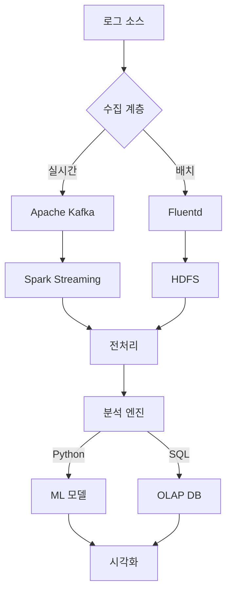

로그 분석 프로그램을 개발할 때 고려해야 할 요소와 적합한 프로그래밍 언어, 시각화 방법을 단계별로 설명드리겠습니다.

### 1. **프로그래밍 언어 선택**
로그 분석에 적합한 언어는 다음과 같으며, 요구사항에 따라 선택할 수 있습니다:

#### **주요 후보 언어**
| 언어       | 장점                                      | 단점                                  | 사용 예시                     |
|------------|-------------------------------------------|---------------------------------------|-------------------------------|
| **Python** | - 풍부한 데이터 분석 라이브러리(pandas, NumPy)<br>- 시각화 도구 다양(matplotlib, Seaborn)<br>- 빠른 프로토타이핑 가능 | - 대용량 데이터 처리 속도 제한적      | 중소규모 실시간 분석          |
| **Java**   | - 멀티스레딩 및 분산 처리에 강함<br>- 안정성 높음<br>- Hadoop/Spark 연동 용이 | - 코드 작성이 복잡함                 | 대규모 분산 시스템 로그 분석  |
| **Go**     | - 고성능 병행 처리(Goroutine)<br>- 간결한 문법<br>- 빠른 실행 속도 | - 데이터 분석 라이브러리 부족        | 고성능 실시간 로그 수집/처리  |
| **Elixir** | - 분산 처리 및 실시간 분석에 최적화<br>- Fault-tolerant 설계 | - 생태계 규모 작음                   | 분산 서버 모니터링           |

#### **추천 선택 기준**
- **실시간성 + 대규모 데이터**: Go/Elixir + Kafka
- **복잡한 분석 + 시각화**: Python + Spark
- **기존 인프라 통합**: Java (Spring Batch)

### 2. **로그 분석 아키텍처 예시**
```plaintext
[로그 수집] → [전처리] → [저장] → [분석] → [시각화]
  │            │           │         │         │
  ├─ Filebeat  ├─ Logstash ├─ ES     ├─ Spark  └─ Grafana
  └─ Fluentd   └─ Python   └─ S3     └─ Pandas
```

### 3. **시각화 도구 비교**
#### **Python 기반**
- **Matplotlib**
  ```python
  import matplotlib.pyplot as plt
  plt.plot(log_times, error_counts)
  plt.title('시간별 에러 발생 추이')
  plt.xlabel('시간')
  plt.ylabel('에러 건수')
  plt.show()
  ```
  - 장점: 커스터마이징 가능
  - 단점: 인터랙티브 기능 부족

- **Plotly/Dash**
  ```python
  import plotly.express as px
  fig = px.line(df, x='timestamp', y='latency', color='server')
  fig.show()
  ```
  - 실시간 대시보드 구현 가능

#### **엔터프라이즈 솔루션**
- **Grafana**
  - ELK Stack(Elasticsearch + Logstash + Kibana)과 연동
  - SQL-like 쿼리로 실시간 차트 생성

- **Tableau**
  - 드래그앤드롭 인터페이스
  - 고급 시각화 가능(히트맵, 트리맵 등)

### 4. **고급 분석을 위한 기술 스택**


### 5. **성능 최적화 팁**
1. **인덱싱**: Elasticsearch로 로그 색인 생성
2. **샘플링**: 대량 데이터 시 1% 샘플 분석
3. **캐싱**: Redis로 빈번한 쿼리 결과 저장
4. **병렬 처리**: Dask(파이썬) 또는 Apache Beam 활용

### 6. **실제 구현 예시 (Python)**
```python
# 로그 파이프라인 예제
import pandas as pd
from datetime import datetime

def parse_log(line):
    # 로그 파싱 로직 (정규표현식 등)
    return {
        'timestamp': datetime.strptime(...),
        'level': 'ERROR',
        'message': ...
    }

# 스트리밍 처리
def process_logs():
    while True:
        logs = get_new_logs()  # API/파일에서 최신 로그 가져오기
        df = pd.DataFrame([parse_log(l) for l in logs])
        
        # 시간별 에러 카운트
        errors = df[df['level'] == 'ERROR'] \
                 .groupby(pd.Grouper(key='timestamp', freq='5min')) \
                 .size()
        
        # 실시간 시각화 업데이트
        update_dashboard(errors)
```

### 결론
- **초기 개발/소규모**: Python + ELK
- **대규모 프로덕션**: Go/Java + Kafka + Spark + Grafana
- **AI 연계**: Python + TensorFlow + Prometheus

최적의 선택은 로그 볼륨, 실시간성 요구사항, 팀의 기술 스택에 따라 달라집니다. 200+ 서버라면 분산 처리 아키텍처가 필수적이며, 간단한 모니터링만 필요하면 Python으로 충분합니다.